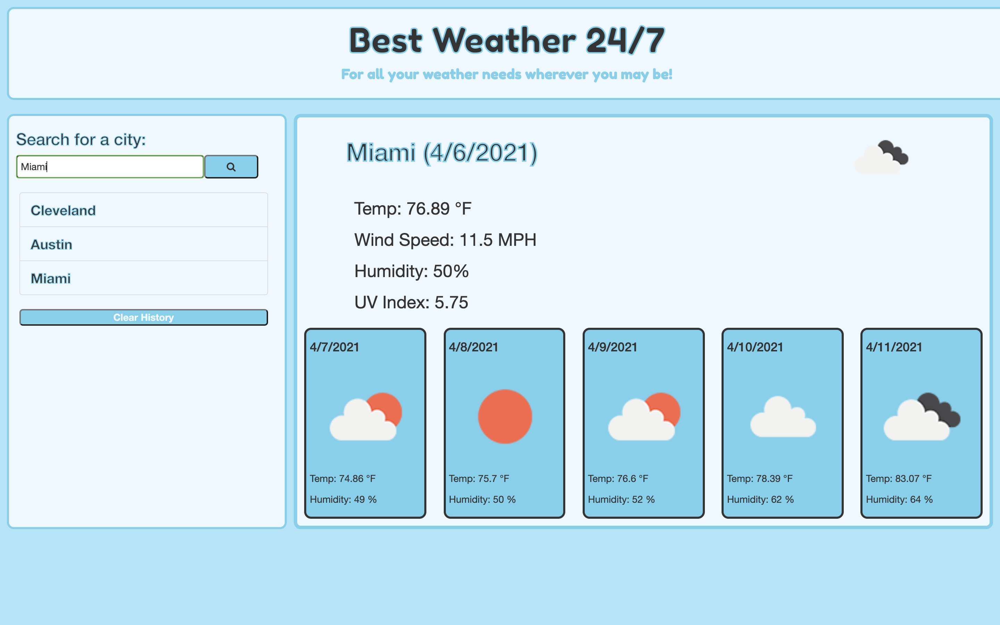

# Best Weather 24/7
A weather dashboard for all your traveling needs!

## Purpose
This weather dashboard is used to find the current weather in a city you search along with a five day forecast.

## Structure
The main structure of this application is created with:
* Bootstrap
* HTML

The HTML consists of containers to hold dynamically created HTML from JavaScript.

The Bootstrap used consists of a navbar and a modal.

## Style
This application is mainly styled with:
* Bootstrap CSS
* Custom CSS
* Google Fonts

Most of the CSS is custom, the colors, the borders, the classes, and flex-box.

The Bootstrap styles were mostly changed.

The Google Font used was Fredoka One: https://fonts.google.com/specimen/Fredoka+One

## Functionality
This applications functionality is made with:
* JQuery
* Vanilla JavaScript

I used a mixture of JQuery and Vanilla to get the best results I could. Some issues with JQuery were fixed using vanilla and vice-versa.

The weather dashboard:
* Searches for a city type in a search input.
* Adds that city to a visible search history in a sidebar.
* Presents current and future weather conditions for that city.
* Presents the city name, the date, an icon representation of weather conditions, the temperature, the humidity, the wind speed, and the UV index.
* The UV Index is presented with a color tht indicates wheter the conditions are low, moderate, high, very high, or extreme. 
* the future weather conditions present a five-day forecast
that displays the date, an icon representation of the weather conditions, the temperature, and the humidity.
* When a city in the search is clicked, it presents the current and future conditions for that city again.

## API's

Open Weather API: 
https://api.openweathermap.org/data/2.5/

GitHub Repo: https://github.com/beau4ta/Best-Weather-24-7

Live Site: https://beau4ta.github.io/Best-Weather-24-7/

